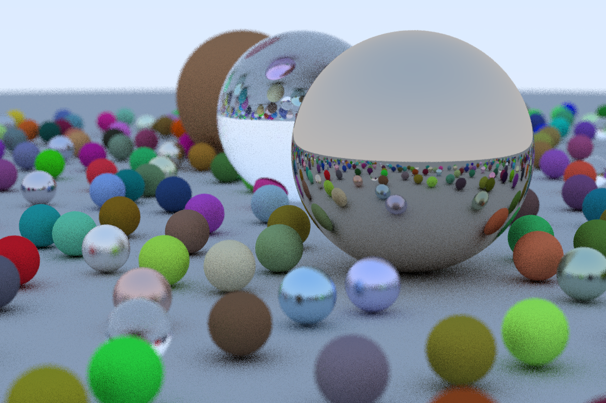

# ray-tracing-iow
[](https://travis-ci.com/nwtgck/ray-tracing-iow-scala)

[Ray Tracing in One Weekend](http://in1weekend.blogspot.jp/2016/01/ray-tracing-in-one-weekend.html) written in Scala




## Run

```bash
./make_jar.sh
./run_jar.sh > out.ppm
```

or

```bash
./make_jar.sh
./run_jar.sh --out-file=out.ppm
```

or

```bash
sbt "runMain io.github.nwtgck.ray_tracing_iow.Main --out-file=out.ppm"
```

Then you will get `out.ppm` image


(Why not `sbt run`? Because it contains `[info] ...` logs. They aren't useless to use `>` redirect.)

## References

Here is useful references.

* [iyahoo/clj-ray-tracing](https://github.com/iyahoo/clj-ray-tracing) (Clojure)
* [petershirley/raytracinginoneweekend](https://github.com/petershirley/raytracinginoneweekend) (C++)